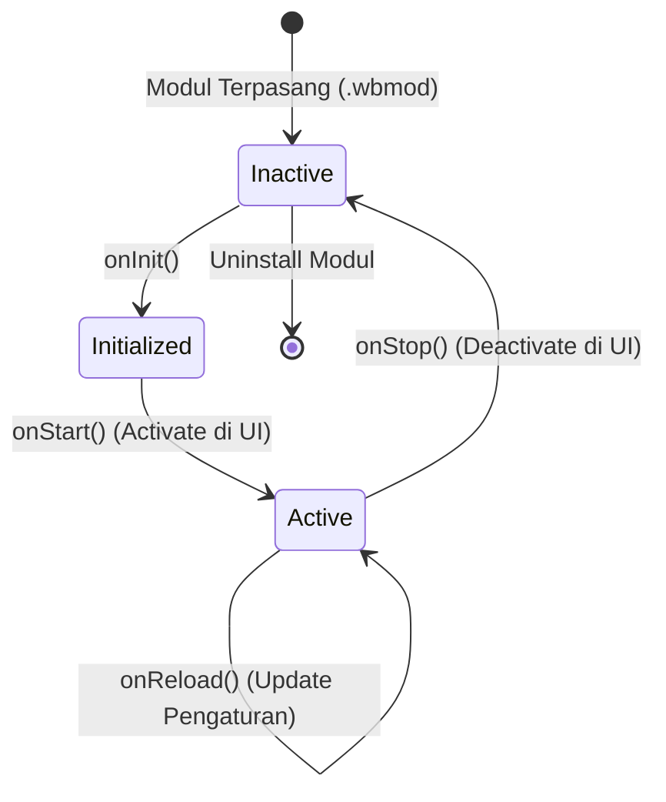

# 🔄 02. Daur Hidup Modul (Lifecycle)

Setiap modul di WagonBox punya siklus hidup (*lifecycle hooks*) yang jelas. Core WagonBox akan memanggil fungsi-fungsi ini di momen-momen tertentu.

---

## 📊 Diagram Siklus Hidup Modul



---

## 🪝 Penjelasan Tiap Hook

### 1. `onInit()` — Inisialisasi Awal
Dipanggil tepat saat modul di-load ke memori VM Sandbox.

**Cocok untuk:** inisialisasi state, baca config, validasi dependensi.

```javascript
async onInit() {
  this.defaultPort = await this.config.get('port') || 8080;
  console.log(`[${this.moduleId}] Init selesai. Port: ${this.defaultPort}`);
}
```

---

### 2. `onStart()` — Mengaktifkan Modul
Dipanggil saat modul di-activate (UI/CLI).

**Cocok untuk:** registerRoute, background timer, socket, file watcher.

```javascript
async onStart() {
  await this.registerRoute('GET', '/status', 'handleStatus');
  this.timer = setInterval(async () => { /* cek berkala */ }, 60000);
}
```

---

### 3. `onStop()` — Graceful Shutdown
Dipanggil saat modul di-deactivate atau pre-uninstall.

**Wajib:** clearInterval, tutup socket, simpan state.

```javascript
async onStop() {
  if (this.timer) { clearInterval(this.timer); this.timer = null; }
  console.log(`[${this.moduleId}] resource dibersihkan`);
}
```

---

### 5. `onDestroy()` — Final Cleanup
Dipanggil setelah `onStop` saat uninstall modul.

```javascript
async onDestroy() {
  // final cleanup, delete temp files, etc.
}
```

---

## 📡 Lifecycle Events (Otomatis)

Modul sekarang otomatis emit event ke Core:

| Event | Trigger |
|-------|---------|
| `module.init` | setelah `onInit` |
| `module.start` | setelah `onStart` |
| `module.stop` | sebelum `onStop` |
| `module.destroy` | setelah `onDestroy` |

Core mencatat event ini untuk audit trail.

---

## 💡 Tips

1. `onInit()` singkat (heavy task di `onStart`).
2. Selalu bersihkan di `onStop`/`onDestroy`.
4. `onReload()` dipanggil saat config diubah via UI.

---

## 🎯 Selanjutnya

Pelajari sistem keamanan di [**03. Kapabilitas & Keamanan**](./03-capabilities-security.md).
