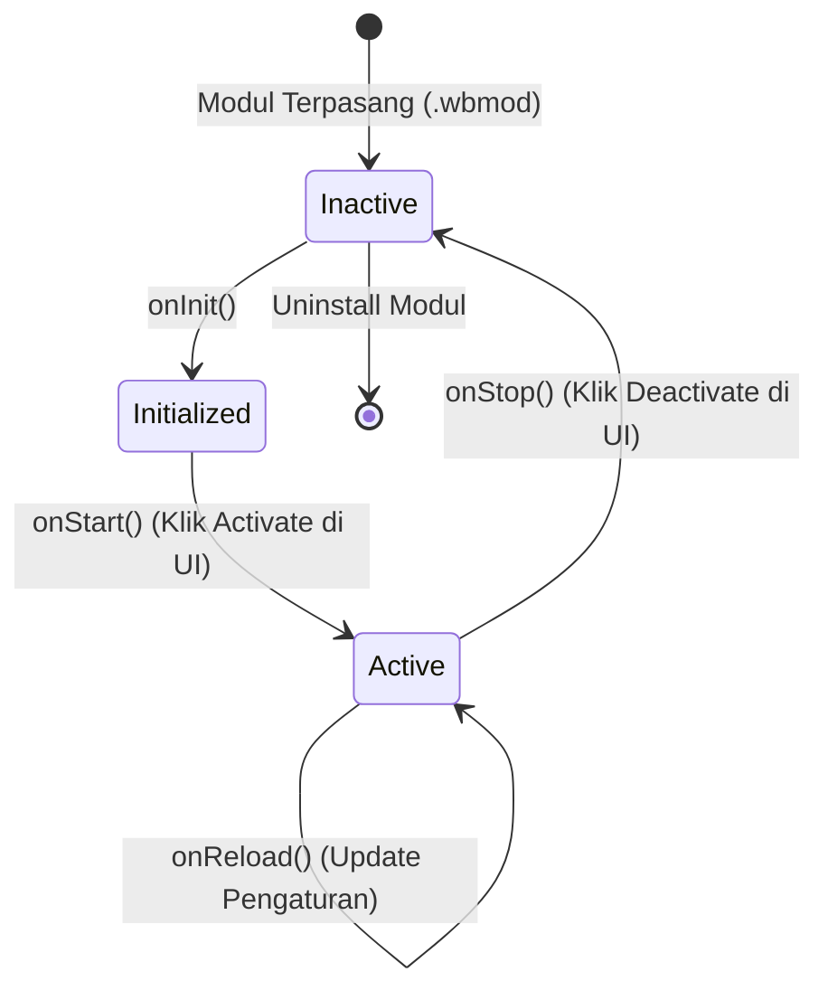

# 🔄 02. Daur Hidup Modul (Lifecycle)

Setiap modul di WagonBox punya siklus hidup (*lifecycle hooks*) yang jelas. Core WagonBox akan memanggil fungsi-fungsi ini di momen-momen tertentu.

---

## 📊 Diagram Siklus Hidup Modul



---

## 🪝 Penjelasan Tiap Hook

### 1. `onInit()` — Inisialisasi Awal
Hook ini dipanggil tepat saat modul pertama kali di-load ke memori VM Sandbox oleh Core.

**Cocok digunakan untuk:**
- Menginisialisasi variabel lokal / state modul.
- Membaca konfigurasi default dari `this.config`.
- Memvalidasi dependensi internal.

```javascript
async onInit() {
  this.defaultPort = await this.config.get('port') || 8080;
  console.log(`[${this.moduleId}] Init selesai. Port default: ${this.defaultPort}`);
}
```

---

### 2. `onStart()` — Mengaktifkan Modul
Hook ini dipanggil saat modul diubah statusnya menjadi **Active** (bisa lewat toggle di web UI WagonBox atau CLI).

**Cocok digunakan untuk:**
- Mendaftarkan endpoint REST API (`this.registerRoute()`).
- Menjalankan background timer atau cron mini internal.
- Membuka koneksi socket atau file watcher.

```javascript
async onStart() {
  // Daftarkan route HTTP
  await this.registerRoute('GET', '/status', 'handleStatus');
  await this.registerRoute('POST', '/restart-service', 'handleRestart');

  // Contoh background interval pengecekan status (setiap 1 menit)
  this.timer = setInterval(async () => {
    // Jalankan task berkala
  }, 60000);
}
```

---

### 3. `onStop()` — Mematikan / Graceful Shutdown
Hook ini dipanggil saat modul diubah statusnya menjadi **Inactive** atau sebelum modul di-uninstall.

**Wajib digunakan untuk:**
- Mematikan `setInterval` atau `setTimeout` agar tidak terjadi *memory leak*.
- Menutup file handle atau koneksi socket terbuka.
- Menyimpan *state* terakhir ke storage atau database sebelum mati.

```javascript
async onStop() {
  if (this.timer) {
    clearInterval(this.timer);
    this.timer = null;
  }
  console.log(`[${this.moduleId}] Semua resource telah dibersihkan.`);
}
```

---

### 4. `onReload()` — Hot-Reload Konfigurasi
Hook ini dipanggil jika pengguna mengubah pengaturan modul di halaman **Settings**, tanpa perlu restart service WagonBox secara keseluruhan.

```javascript
async onReload() {
  // Ambil konfigurasi baru yang baru saja diedit admin
  const newTimeout = await this.config.get('timeout');
  this.timeout = newTimeout || 5000;
  console.log(`[${this.moduleId}] Konfigurasi diperbarui! Timeout baru: ${this.timeout}ms`);
}
```

---

## 💡 Tips Praktis Lifecycle

1. **Jangan lakukan tugas berat di `onInit()`**: Usahakan `onInit()` seringan mungkin karena dipanggil saat scan bootstrapper.
2. **Selalu bersihkan di `onStop()`**: Jangan sampai modul meninggalkan proses zombie atau memory leak di sistem host.
3. **Async/Await Ramah**: Semua hook mendukung `async/await`, jadi kamu bisa menunggu proses I/O selesai sebelum melanjutkan status.

---

## 🎯 Selanjutnya

Pelajari bagaimana cara kerja sistem keamanan dan pembatasan izin di [**03. Sistem Kapabilitas & Keamanan**](./03-capabilities-security.md).
